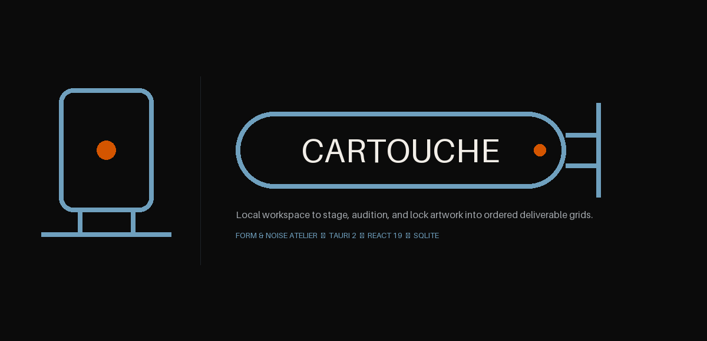

<div align="center">


# Cartouche

### *Local workspace to stage, audition, and lock artwork into ordered deliverable grids.*

[](https://github.com/FormAndNoise)
[](https://github.com/FormAndNoise/cartouche/releases)
[](https://tauri.app)
[](https://react.dev)
[](https://www.typescriptlang.org)
[](https://www.rust-lang.org)
[](https://sqlite.org)
[](https://opensource.org/licenses/MIT)

</div>

---

## 🏛️ Overview

**Cartouche** is a local-first desktop application engineered for visual artists, art directors, game designers, and printmakers managing multi-deliverable artwork series. 

Whether you are creating a 78-card tarot deck, a 200-card trading card game, a suite of UI icons, or shot-by-shot storyboards, Cartouche replaces file-folder chaos with a tactile, visual grid workspace. You define your target deliverable grid, audition multiple artwork variations per slot, attach deck metadata, and lock winning illustrations into place.

<div align="center">
  
</div>

> [!NOTE]
> **Form & Noise Design Law**: Cartouche is built on the *Loose Endorsed Family* identity. Every socket grid item displays a strict state pip system—visualizing unlocked draft iterations vs. locked final deliverables in House Metal (`#D45500`).

---

## 🎨 Visual Design System & Brand Tokens

Cartouche adheres to the **Form & Noise** design system for high-contrast accessibility, clear typographic hierarchy, and tactile visual feedback.

### 🎨 Color Palette & Design Tokens

| Token Role | Hex Code | Visual Sample | Usage |
|---|---|---|---|
| **Accent (Light)** | `#3F6E8C` | `■` | Primary interactive controls, selected card borders (Paper Ground) |
| **Accent (Dark)** | `#6FA0BE` | `■` | Primary interactive controls, selected card borders (Void Ground) |
| **House Metal** | `#D45500` | `■` | **Locked State Pip**, winner badges, brand endorsement tags |
| **Paper Ground** | `#F6F1EA` | `■` | Light mode canvas background, card backing |
| **Void Ground** | `#0B0B0B` | `■` | Dark mode canvas background, root shell background |
| **Ink Foreground** | `#141414` / `#F2EEE8` | `■` | High-contrast body text and crisp UI labels |
| **Muted Hairline** | `#8A8680` / `#1F2428` | `■` | Unlocked slot borders, structural grid divides, empty socket dashed strokes |

### 🔤 Typography Hierarchy

| Font Family | Classification | Usage |
|---|---|---|
| **Space Grotesk** | Display / Wordmark | Application header, project title nameplate, modal headers (tracking $-1\%$ to $-2\%$) |
| **Inter** | Interface / Body | Form inputs, metadata labels, detail panel attributes, socket status indicators |
| **IBM Plex Mono** | Code / Data | Asset hashes (`sha256`), file paths, SQLite schemas, IPC payloads, keyboard shortcut badges |

---

## ⚡ Quick Start & Download

### 📥 Download Pre-Built Releases (For Users)

Ready-to-use desktop binaries for **Windows**, **macOS**, and **Linux** are published on GitHub Releases. No database setup or development tools required.

1. Go to the [**Cartouche GitHub Releases**](https://github.com/FormAndNoise/cartouche/releases) page.
2. Select the latest release and download the installer package for your operating system:
   - **Windows**: `Cartouche_x64_en-US.msi` (Installer) or `Cartouche_x64.exe` (Executable).
   - **macOS**: `Cartouche_x64.dmg` / `Cartouche_aarch64.dmg` (Apple Silicon & Intel Mac disk image).
   - **Linux**: `Cartouche_amd64.AppImage` (Universal AppImage) or `cartouche_amd64.deb` (Debian/Ubuntu package).
3. Run the installer and launch **Cartouche**.

---

### 🛠️ Build From Source (For Developers)

Follow these steps to inspect the Tauri IPC bridge, run the UI test sandbox, or compile Cartouche binaries locally.

#### Prerequisites

| Tool | Minimum Version | Installation Link |
|---|---|---|
| **Node.js** | `>= 20.x` | [nodejs.org](https://nodejs.org) |
| **pnpm** (or npm) | `>= 9.x` | [pnpm.io](https://pnpm.io) |
| **Rust** | Stable (`1.77+`) | [rustup.rs](https://rustup.rs) |
| **Tauri CLI 2.x** | `^2` | `cargo install tauri-cli --version "^2" --locked` |
| **Native Toolchain** | MSVC 2019+ (Win) / Xcode CLI (macOS) / `build-essential` + `libwebkit2gtk-4.1-dev` (Linux) | System-specific C/C++ compiler |

#### Developer Workflow Commands

```bash
# 1. Clone the repository
git clone https://github.com/FormAndNoise/cartouche.git
cd cartouche

# 2. Install frontend dependencies & pre-fetch Rust crates
pnpm install
cd src-tauri && cargo fetch && cd ..

# 3. Launch Development Environment
# Desktop Shell with Tauri 2 + React 19 / Vite Hot-Reloading:
pnpm dev:tauri

# Browser Sandbox (Runs in browser using in-memory MockBackendClient):
pnpm dev

# 4. Automated Test Suites
# Frontend Vitest + React Testing Library suite:
pnpm test:frontend

# Backend Rust unit & integration test suite:
cd src-tauri && cargo test && cd ..

# Full check (install + lint + test + build):
make check

# 5. Compile Release Binaries & Installers
npx @tauri-apps/cli build
# or: pnpm build
```

The compiled native executable and OS installer packages will be placed in `src-tauri/target/release/bundle/`.

---

## 🎯 Problems Solved

Visual producers managing fixed-count asset series face systemic friction when using general-purpose tools like standard OS file explorers, cloud drives, or generic kanban boards:

1. **Artwork Revision Chaos**: Files scattered across folders named `sun_card_v2_final_color_edit2.png`. Cartouche groups all candidates into a single target socket, eliminating duplicate filename confusion.
2. **Completion Blind Spots**: Visualizing progress across 78 tarot cards or 120 TCG cards in traditional file views is painful. Cartouche provides immediate grid completion metrics, filtering by status (`not_started`, `in_progress`, `needs_review`, `done`), medium, and custom tags.
3. **Destructive Auditioning**: Selecting a final illustration often means discarding or burying alternative sketches and colorways. Cartouche allows side-by-side variation auditioning, locking a winning candidate while preserving non-selected options in the socket detail panel.
4. **Cloud Lock-in & Privacy Risks**: Sensitive unreleased IP locked in proprietary SaaS web applications. Cartouche operates 100% offline, keeping your project contained in open, portable `.tarot` folders with embedded SQLite databases.
5. **Metadata Disconnect**: Spreadsheet rows detached from artwork files. Cartouche ingests CSV metadata (titles, notes, classifications) and binds them directly to target image sockets.

---

## 🎨 Real-World Use Cases (Beyond Tarot)

While named after the ancient Egyptian protective frame and tailored for tarot production, **Cartouche is a universal deliverable grid system**:

- **🎴 Trading Card Games (TCGs) & Collectible Card Games (CCGs)**: Stage creature art, spell cards, item frames, rarity tiers, and expansion booster sets in fixed grid sizes (e.g., 64-card or 120-card releases).
- **🎲 Board Games & Tabletop Systems**: Organize action cards, quest tiles, encounter decks, character sheets, and rulebook figure assets.
- **🎨 UI/UX Design & Icon Sets**: Audition system icons, component visual variants, state audits (default, hover, active, disabled), and mobile screen flows into locked grid slots.
- **🎬 Storyboarding & Animation Keyframe Sequences**: Layout animatic panels, script beat cards, shot-by-shot sequence planning, and scene transitions.
- **🖼️ Printmaking & Fine Art Portfolios**: Manage limited-edition print series, etching runs, photography portfolios, and gallery cataloging.
- **📚 Educational Flashcards & Visual Reference Guides**: Build anatomy reference decks, language learning flashcards, field guides, and museum catalog grids.

---

## ✨ Key Features

- 🗃️ **Fixed-Socket Grid Canvas**: Establish immutable deliverable slots (e.g., 78 tarot cards, 64-card expansion sets) upon project creation. Filter by completion percentage, status, medium, and custom tags.
- 🎭 **Variation Auditioning**: Attach multiple artwork candidates, sketches, and color variants per socket. Compare candidate works side-by-side in the inspection panel.
- 🔒 **Locking Policy**: Select a winning artwork variation to lock the socket. Non-winning variations remain safely archived and retrievable.
- 📋 **Batch CSV Import**: Ingest deck lists, card titles, arcana classifications, and descriptive metadata in a single pass with background job tracking.
- 🔮 **Planning Scratchpad & Counterpart Matrix**: Organize cross-dimensional categories (Major/Minor arcana, Suits, Elements, Factions) in synchronized grid matrices.
- ⚡ **Local-First & Portable**: Projects are self-contained `.tarot/` folders containing an embedded WAL-mode SQLite database (`project.sqlite`), content-addressed assets (`assets/<sha256>.<ext>`), and optimized WebP cached previews.
- 📦 **One-Click Bundling & Repair**: Export and import `.crtch` compressed deck bundles for backup and cross-machine portability, complete with automated asset repair scans.
- 🔒 **100% Offline & Private**: Zero cloud dependencies, zero telemetry, full offline functionality.

---

## 🏗️ Architecture & Data Flow

Cartouche relies on a clean separation between the frontend interface and native system services via a unified `BackendClient` contract:

```
┌────────────────────────────────────────────────────────────────────────┐
│ React 19 Frontend (Vite) │
│ Space Grotesk (Display) • Inter (UI) • IBM Plex Mono (Code) │
└───────────────────────────────────┬────────────────────────────────────┘
 │ BackendClient Interface Contract
 ┌───────────────────────┴───────────────────────┐
 ▼ ▼
┌───────────────────────────┐ ┌────────────────────────┐
│ TauriBackendClient │ (Production) │ MockBackendClient │ (Tests / Dev)
│ tauri::invoke() IPC │ │ In-Memory Fast State │
└─────────────┬─────────────┘ └────────────────────────┘
 ▼
┌────────────────────────────────────────────────────────────────────────┐
│ Rust Native Core (Tauri 2) │
│ Project Service • Socket Service • Work Service • Asset Ingester │
└───────────────────────────────────┬────────────────────────────────────┘
 │
 ▼
┌────────────────────────────────────────────────────────────────────────┐
│ Portable .tarot Project Store │
│ ├── project.sqlite (6 Tables, WAL mode, Foreign Keys) │
│ ├── assets/ (<sha256>.<ext> Content-Addressed Store) │
│ ├── previews/ (<work-id>.webp Cached Previews) │
│ └── manifest.json │
└────────────────────────────────────────────────────────────────────────┘
```

### Data Model & SQLite Schema

Projects persist data across 6 SQLite tables:
- **`projects`**: Stores project configuration, name, fixed socket count, and grid column layout (1–4).
- **`sockets`**: Manages socket slots, positions, titles, notes, custom metadata JSON, lock status, and locked work selection.
- **`works`**: Stores attached candidate artwork, content hashes (`sha256`), file names, media kinds, and timestamps.
- **`previews`**: Manages WebP preview thumbnail caching state.
- **`extracted_text`**: Stores text extracted from attached documents.
- **`import_jobs`**: Tracks asynchronous background job status, progress, warnings, and results.

---

## 📁 Repository Layout

```
.
├── src/ # React 19 / TypeScript frontend (Vite)
│ ├── App.tsx # Root application component
│ ├── main.tsx # Vite entry point
│ ├── components/ # UI components (SocketGrid, SocketCard, DetailPanel, etc.)
│ ├── state/ # BoardProvider and React context state store
│ ├── api/ # BackendClient interface, TauriBackendClient & MockBackendClient
│ ├── lib/ # Deck taxonomy, planning matrices, and theme engine
│ └── __tests__/ # Vitest + React Testing Library suites
├── src-tauri/ # Rust / Tauri 2 native core
│ ├── src/
│ │ ├── lib.rs # Tauri builder + IPC commands
│ │ ├── main.rs # Binary entry
│ │ ├── error.rs # Structured ApiError envelope
│ │ ├── db.rs # SQLite schema & migrations
│ │ ├── project.rs # Project lifecycle service
│ │ ├── socket.rs # Socket CRUD & lock invariants
│ │ ├── work.rs # Work attachment & thumbnail generation
│ │ ├── csv_import.rs # CSV streaming importer & parser
│ │ ├── extract.rs # Document text extraction
│ │ ├── export.rs # Portable .crtch zip deck bundle export & import
│ │ └── repair.rs # Missing & orphaned asset repair scan
│ ├── Cargo.toml
│ ├── tauri.conf.json # Tauri configuration (window, bundle, dev server)
│ ├── capabilities/ # Tauri 2 permission capabilities
│ └── icons/ # Multi-resolution desktop icons (ICO, ICNS, PNG)
├── brand/ # Official Form & Noise brand guidelines & SVGs
├── package.json # Frontend deps + build scripts
├── Makefile # install / build / test / lint / dev
├── BUILD_PLAN.md # Component inventory + build sequence
├── REQUIREMENTS.md # User stories + acceptance criteria
└── ARCHITECTURE.md # Technical architecture + data model
```

---

## 🎨 Brand Standard

Cartouche is part of the **Form & Noise** portfolio of creative tools and follows the *Loose Endorsed Family* identity:
- **Symbol**: 24×24u, 1.75u stroke, true Cartouche stadium enclosure with knot seal baseline and `#D45500` House Metal locked state pip.
- **Palette**: Slate-Blue (`#3F6E8C` / `#6FA0BE`), Void Ground (`#0B0B0B`), Paper Ground (`#F6F1EA`), House Metal (`#D45500`).
- **Typography**: Space Grotesk (Display), Inter (UI), IBM Plex Mono (Data & Code).
- **Guidelines**: Full brand standards documented in [**`brand/BRAND.md`**](brand/BRAND.md).

---

## 📄 License

MIT © [Form & Noise](https://github.com/FormAndNoise).